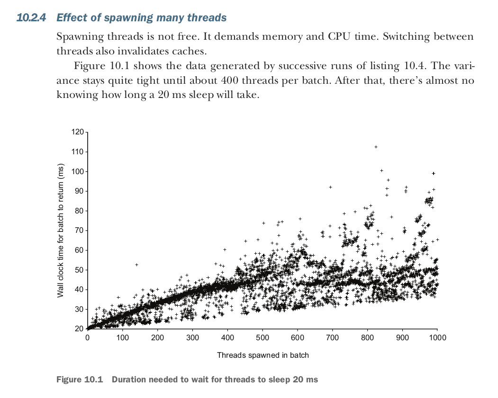
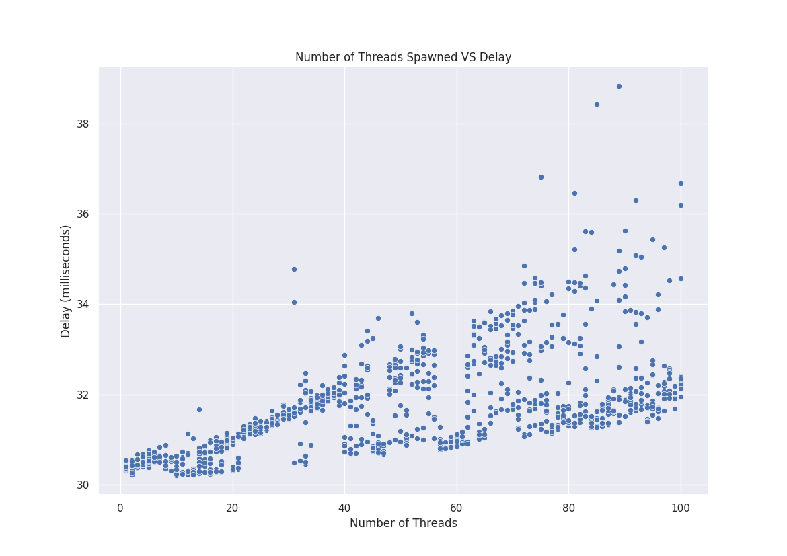

# Effect of Spawning Many Threads
- From Rust in Action Book (Chapter 10 Section 10.2.4), McNamara shows this plot


- This shows how increasing the number of thread spawns affect the compute resources in terms of computing the time delay starting from pre-spawing of threads until post-spawning.

## Replication of Results

By Logging the results using the following code snippets

```rust
fn spawn_threads(params: Params) {
    println!("number_of_threads,sample_number,delay");
    // Generate thread count
    for thread_count in 1..params.num_threads + 1 {
        // Generate n number of sample per thread count
        for n in 0..params.sample_per_step {
            let mut handles = Vec::with_capacity(thread_count as usize);
            let start = time::Instant::now();

            // Spawn thread based on thread count
            for _ in 0..thread_count {
                let handle = thread::spawn(move || {
                    let pause = time::Duration::from_millis(
                        params.delay
                    );
                    thread::sleep(pause);
                });
                handles.push(handle);
            }

            // Wait for all threads to get finished
            for handle in handles {
                handle.join().unwrap();
            }

            let finish = time::Instant::now();
            let time_diff = finish.duration_since(start).as_micros() as f64;
            println!("{},{},{:02}", thread_count, n, time_diff / 1000.0);
        }
    }
}
```

And running the following 

```bash 
cargo run -- -d 30 -n 100 -s 10 > data/thread_delays.csv && python plot.py data/thread_delays.csv data/thread_image.png
```

I end up producing this plot. Which approximately replicates McNamara's result

